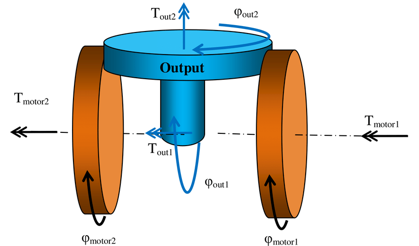
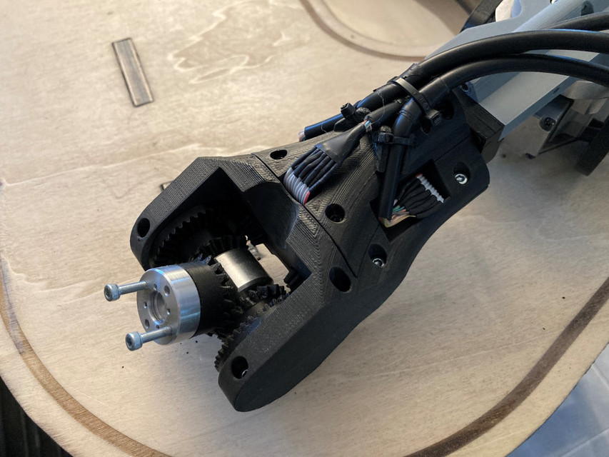
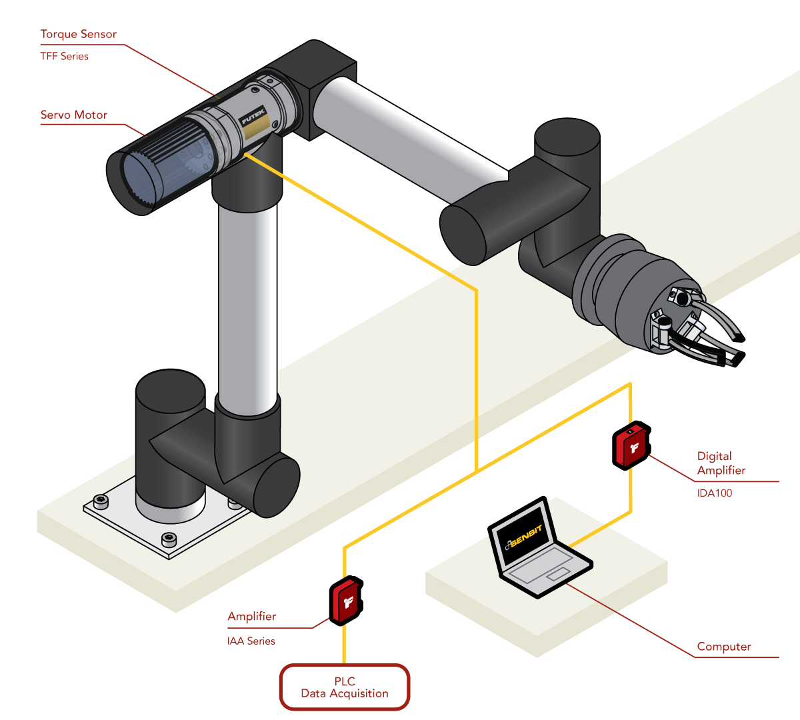

# Differential Axis Control 

Simple abstract classes for single and multi axis speed/acceleration control. **In Progress**

## TODO: 
Expand Test Code
Complete Jerk limiting
## Setup 
mkdir build
sudo make install 
or 
Download zip 

## Overview
### MultiAxis<num_axis>

```Meant for when a change in the speed of one motor can affect the speed of multiple axes. So the speed of each axis must be managed simultaneously```

|||
|---|---|
|||

This class will instantiate a list of ```Axis``` objects automatically and then the corresponding override functions will allow the same level of control but with the consideration that changes on one Axis may affect other axes.

``` cpp
#include "axis_control/multi_axis.h"

class MyRobot: MultiAxis<3>{

    PID motor[3];
    joint_sensor[3];

unsigned int getTime() override {};
/* If the time passed since isn't passed into the run function then this allows the 
object to grab how many units of time passed since the program started and compute speed + acceleration. 
            e.g millis();
*/

void computeAxisPositions(double *axis_positions) override {
     for(int i = 0; i < 3; i++) axis_positions[2] = joint_sensor[i].value;
};
/* this function is passed a pointer in which to store the current position of each controlled axis in order */

void updateMotorSpeeds(double *axis_speeds) override { 
    motor[i].setpoint = axis_speeds[i] * reductions;
};
/* this function is passed a pointer to all of the current target speeds that each axis should attempt to achieve. 
The instantaneous motor speeds should then be calculated by the user and applied for proper control*/

void pollMotors() override {
   for(int i = 0; i < 3; i++) motor[i].update(axis[i].real_speed);
};
/* this function is meant to stand in the place of anything that needs to be called as often as 
possible for the motors to move at an appropriate speed

    e.g AccelStepper::runSpeed()
*/
}

MyRobot.setLimitMode(0);// Default: Limit Speed

MyRobot.axis[0].setTargetSpeed(5)// deg/s
MyRobot.axis[1].setTargetSpeed(10)// deg/s
MyRobot.axis[2].setTargetSpeed(4)// deg/s

double home_pose[3] = {90, 0, 90};
double second_pose[3] = {30, 45, 10};
double jojo_pose[3] = {71, 24, -45};

MyRobot.moveAllTo(home_pose);
MyRobot.runToPositions();

MyRobot.setLimitMode(1); // Limit Acceleration

MyRobot.axis[0].setTargetAcceleration(2.5) // deg/s^2
MyRobot.axis[1].setTargetAcceleration(1) // deg/s^2
MyRobot.axis[2].setTargetAcceleration(3) // deg/s^2

MyRobot.axis[0].moveTo(second_pose[0]);
MyRobot.axis[1].moveTo(second_pose[1]);
MyRobot.axis[2].moveTo(second_pose[2]);
while (MyRobot.run());

MyRobot.setLimitMode(2); // Limit Jerk NOTE: Work in progress and lots of math so mileage may vary on arduinos

MyRobot.axis[0].setTargetJerk(1.25) // deg/s^2/s
MyRobot.axis[1].setTargetJerk(.5) // deg/s^2/s
MyRobot.axis[2].setTargetJerk(1.5) // deg/s^2/s

MyRobot.moveAllTo(jojo_pose);
MyRobot.runToPositions();

```

### Axis
``` Can be used for controlling a single axis at a time ```



``` cpp
/*
 These functions work basically the same as the ones I described above but for a single access it's not necessary to try and override these if you just want to use the MultiAxis class. 
*/
virtual unsigned int getTime();
virtual void computePosition(double *axis_position);
virtual void updateMotorSpeed(double *axis_speed);
virtual void pollMotor() {};
```
